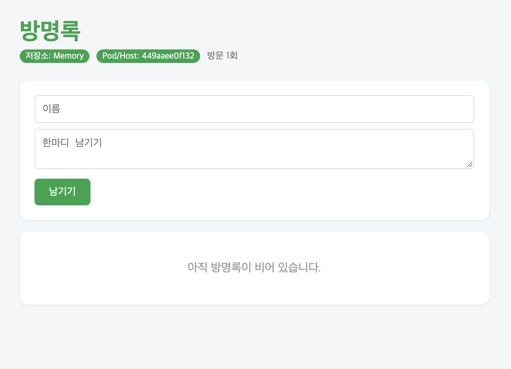

# README

# 6주차 정리

- 내 이미지 주소: ghcr.io/kongmajitenshi/guestbook:v2
- 
- Dockerfile의 각 줄이 하는 일
    - FROM python:3.12-slim: 가져올 이미지 지정. 여기선 파이썬3.12 슬림버전
    - WORKDIR /app: 컨테이너 내부 어디에서 작업할건지 지정
    - COPY requirements.txt .: 현재 폴더(컨테이너 내부 /app)로 requirements.txt 파일 복사하기(앱 실행에 필요한 것들 적혀있음)
    - RUN pip …: 위에서 복사한 txt 파일의 라이브러리들 설치.
    - COPY . .: 모든 파일 복사
    - RUN useradd -m appuser: appuser라는 사용자 생성. 루트로 권한 다주면 사고남.
    - USER appuser: 위에서 만든 appuser로 모든거 다 실행함. USER를 appuser로 지정해줌.
    - EXPOSE 5000: 5000번 포트를 쓰겠다고 명시해줌. 실제로 동작을 하는건 아니고 말 그대로 알려만 주는 것. 나중에 실행할 때 5000번으로 지정해주면 됨.
    - CMD […]: 컨테이너 시작 시 실행할 명령. 배열 형태로 지정.
    - 참고: RUN은 이미지 만들 때 한번만 실행, CMD는 컨테이너 생성할 때마다 실행

- 빌드 캐시가 동작한 로그

=> CACHED [2/6] WORKDIR /app                                                                                           0.0s
=> CACHED [3/6] COPY requirements.txt .                                                                           0.0s
=> CACHED [4/6] RUN pip install --no-cache-dir -r requirements.txt                               0.0s

- 설정 넣는 법 요약
    - 코드: 코드 내부에 지정된 값을 바꿔줘야함. 코드를 실행할 때 바뀌는거임. app.py를 수정하면 컨테이너 생성할 때 app.py가 실행되니, 컨테이너 생성할 때 바뀐 값이 적용될듯.
    - ENV: 이미지 빌드할 때 설정됨. Dockerfile 내부 값 바꿔주면 됨.
    - -e: 컨테이너 실행(docker run)할 때 내가 지정해줌.
    - 우선순위: -e > ENV > 코드
    - 참고1: 우선순위는 당연하게도 컨테이너 실행할 때 지정해주는게 가장 높음. 외울게 아니라, 실행할 때 지정해주니까 당연히 기존에 지정해뒀던 ENV값에 덮어씌워주는 느낌. 단, -e로 지정하는건 ENV 값 자체를 건드리는게 아니라 이번 실행엔 이렇게 할게~ 하고 알려주는 느낌.
    - 참고2: 코드에 지정해주는건, APP_TITLE을 이걸로 한다! 가 아니라, 값이 없다면 이걸로 지정해주는거임. 기본값 지정해주는 느낌. 그래서 ENV값이 이미 설정이 되어있다면 그냥 그 값을 불러올 뿐임. 없을 때 에러 방지 해주는 느낌.
